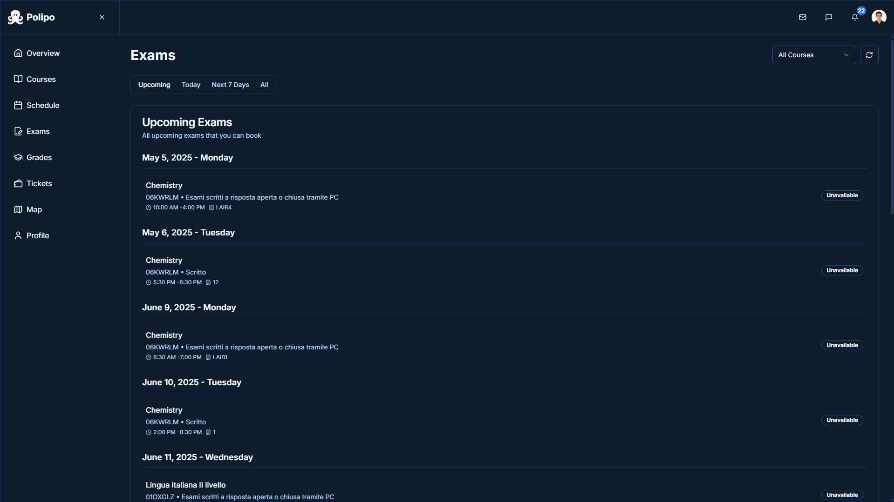
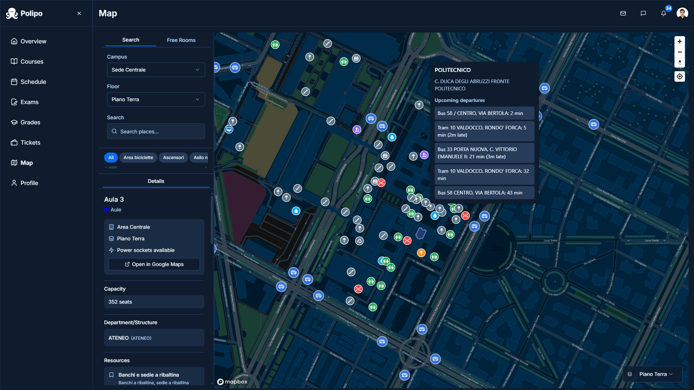

# Polipo

> A modern, user-friendly portal for PoliTO students.


## Table of Contents

- [Polipo](#polipo)
  - [Table of Contents](#table-of-contents)
  - [About](#about)
  - [Screenshots](#screenshots)
  - [Features](#features)
  - [Todo](#todo)
  - [Getting Started](#getting-started)

---

## About

**Polipo** is a redesigned version of the original PoliTO portal, built with a focus on user experience and modern web standards. The goal is to provide students and faculty with a clean, intuitive interface for accessing university services, grades, schedules, and more.

---

## Screenshots

Below is a preview of the main pages. (All images are under `./screenshots/`.)

<details open>
<summary>Click to expand screenshots</summary>

1. **Login Page**  
   

2. **Dashboard**  
   

3. **Course List**  
   

4. **Course Info**  
   

5. **Course Files**  
   

6. **Schedule**  
   

7. **Custom Schedule**  
   

8. **Exams**  
   

9. **Exam Details**  
   

10. **Grades**  
    

11. **Tickets**  
    

12. **Ticket Details**  
    

13. **Map**  
    

14. **Map Details**  
    

15. **Profile**  
    

16. **Mail (Beta)**  
    

</details>

---

## Features

- ✅ User authentication (login/signup/reset password)
- ✅ Dashboard overview of your courses, grades, and schedule
- 🌙 Optional dark and PoliTO themes

---

## Todo

Use this checklist to track upcoming work.  
- [x] Implement exam booking system  
- [x] Add maps for room navigation
- [x] Add support for free room lookup
- [x] Introduce upcoming exams section
- [x] Implement custom events in the schedule using Appwrite
- [x] Add feedback button
- [x] Add timestamps for uploaded files
- [x] Add 404 page for broken routes
- [x] Add OpenGraph support
- [x] Redesign notifications and messages UX
- [x] Add proper login device info
- [x] Add date order to exam page
- [x] Fix bugs with free room display, exam booking, etc.  
- [x] Added support for weekend classes
- [x] Add next lecture to course info
- [x] Add surveys
- [x] Add following, followers, and profile features
- [x] Add support for sso login (unofficial)
- [ ] Add multi-language support (Italian, English, and Turkish)
- [ ] Redesign email client
- [ ] Add support for creating tickets
- [ ] Integrate MFA login (waiting for API support)
- [ ] Polish mobile responsiveness
- [ ] Optimize performance & accessibility
- [ ] Clean up & refactor code before public release

---

## Getting Started

> **Note:** The full source code is private during beta. This public repo is demo-only (screenshots and roadmap).  

1. Clone this repo (or fork for your own portal ideas):
   ```bash
   git clone https://github.com/AlpMeteSenel/polipo.git
